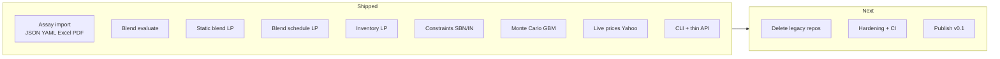

# crude — Project Roadmap

**Last updated:** July 2026  
**Status:** Core port complete; consolidation and hardening in progress

---

## Vision

One Rust codebase for crude oil assay handling, blend evaluation, and procurement optimization — replacing four fragmented Python repos with a single CLI-first tool and a thin HTTP API.

**Principles**

- One winner per capability (no compatibility shims, no duplicate solvers)
- Canonical domain types: `Crude`, `Assay`, `BlendRecipe`, `BlendComponent`
- YAML scenario contracts for all optimization jobs
- Parity-tested against legacy Python golden outputs before deleting old code
- No UI, lakehouse, or trading boilerplate in scope unless explicitly added later

---

## Where we are today



| Area | Status | Notes |
|------|--------|-------|
| Domain model | Done | `crude-domain` |
| Assay import | Done | JSON, YAML, Excel, PDF text extraction |
| Blend properties | Done | Volume-weighted linear |
| Product + SBN/IN constraints | Done | CLI `compatibility` |
| Static blend optimize | Done | Minimize feed cost LP |
| Multi-month blend schedule | Done | Parity vs Python tiny fixture |
| Multi-month inventory | Done | Parity vs Python refinery fixture |
| Monte Carlo | Done | GBM price simulation |
| Live prices | Done | Yahoo WTI/Brent |
| CLI | Done | All primary workflows |
| API | Done | Mirrors CLI; inline YAML/base64; run listing |
| Storage | Done | Unified `RunRecord` + metadata |
| Legacy repo deletion | Done | July 2026 |
| PyPI / binary release | Partial | Release workflow added; tag `v*` to publish |

**Test coverage:** 28 workspace tests (unit + integration + parity).

---

## Phase 0 — Consolidation cleanup *(now)*

**Goal:** Close the replacement merge and make `crude/` the only source of truth.

| Task | Exit criteria | Status |
|------|---------------|--------|
| Delete primary Python repos | `crude-assay`, `crude-blending`, `crude-inventory-optimizer`, `crude_optimizer 2` removed from `cude/` | Done |
| Archive golden artifacts | Any remaining `test_optimization_results/` copied into `fixtures/parity/` | Done |
| Update top-level `cude/` README | Points only to `crude/` | Done |
| Tag migration complete | `v0.1.0-migration` git tag | Done |

**Out of scope:** Rebuilding Streamlit, Next.js, Dash, or Flask UIs.

---

## Phase 1 — Hardening *(~2 weeks)*

**Goal:** Production-quality defaults for a library + CLI used in real workflows.

### 1.1 Solver & optimization

- [ ] Evaluate `microlp` vs `coin_cbc` / `highs` for larger scenarios (performance + numerical stability)
- [x] Infeasibility diagnostics: preflight bound checks + post-solve conflict hints when LP fails
- [x] Shadow prices / dual values on inventory and blend schedule outputs (finite-difference sensitivity on site limits)
- [x] Multi-month blend schedule parity on a **12-month** fixture (not just tiny 1-month)
- [x] GitHub Actions CI (`cargo test`, `clippy`, `fmt`)

### 1.2 Assay pipeline

- [ ] PDF table extraction beyond regex (structured rows from assay report tables)
- [ ] Assay validation report (warnings vs errors) returned from import, not only normalized `Crude`
- [ ] Golden PDF fixtures from legacy repo (if any exist) + regression tests

### 1.3 Economics & prices

- [x] Historical price series fetch (2y daily) — Yahoo chart range
- [x] Price cache file (JSON on disk, TTL) — `~/.cache/crude/` or `CRUDE_CACHE_DIR`

### 1.4 Storage & runs

- [x] Unified `RunRecord` for static blend, blend schedule, and inventory outputs
- [x] `crude compare` works across run types with normalized summary fields
- [x] Run metadata: solver, crude version, optional git commit on saved runs

### 1.5 CLI polish

- [x] `--json` / `--quiet` flags on all commands
- [x] Exit codes: `0` optimal, `1` error, `2` infeasible
- [x] `crude doctor` — check solver, network (prices), fixture paths

---

## Phase 2 — API & integration *(~3–4 weeks)*

**Goal:** Thin HTTP service suitable for scripting and light orchestration — not a full product backend.

| Endpoint (existing) | Enhancement |
|---------------------|-------------|
| `POST /assay/import` | Path **or** `format` + `content_base64` upload |
| `POST /blend/evaluate` | Path **or** inline `yaml` body |
| `POST /blend/schedule/optimize` | Path **or** inline `yaml` |
| `POST /optimize` | Path **or** inline `yaml` |
| `POST /inventory/optimize` | Path **or** inline `yaml` |
| `GET /prices/fetch` | Spot (`?no_cache`) or history (`?history=2y`) with disk cache |
| `GET /runs` | List saved runs from `CRUDE_RUNS_DIR` |
| `GET /runs/{run_id}` | Fetch one run record |
| `POST /simulate` | (already exists) |

**Non-goals for Phase 2:** Auth, multi-tenant DB, WebSockets, GraphQL.

---

## Phase 3 — Distribution *(~1–2 weeks)*

**Goal:** Installable artifact for non-Rust users.

- [ ] `cargo install` from git tag
- [x] GitHub release with prebuilt binaries (macOS arm64/x86_64, Linux x86_64) — push `v*` tag
- [ ] Optional PyPI wrapper (`crude-cli` subprocess) only if there is demand — prefer native binary
- [x] Versioned scenario schema (`schemas/blend-schedule.v1.json`, `inventory.v1.json`, `static-blend.v1.json`)

---

## Phase 4 — Quality & observability *(ongoing)*

**Goal:** Confidence to change solvers and scenarios without silent regressions.

- [x] CI: `cargo test --workspace`, `cargo clippy`, `cargo fmt --check`
- [ ] Expand parity suite: import every legacy golden JSON under `fixtures/parity/` (legacy Streamlit CSV/summary sanity checks added)
- [ ] Benchmark harness for LPs (tiny / refinery / 12-month synthetic)
- [ ] Property tests on blend linearity (API, sulfur mix)
- [ ] Document solver tolerances and units in `docs/units.md`

---

## Phase 5 — Future capabilities *(backlog)*

Only pursue if there is a concrete user or workflow need. Default: **no**.

| Idea | Rationale | Dependency |
|------|-----------|------------|
| Distillation yield optimization | Was stub/demo in Python gasoline LP | New LP formulation |
| Crude-to-crude compatibility matrix | Batch SBN/IN over assay library | Assay corpus |
| Scenario bundles | Multi-scenario sensitivity (price shocks) | Scenarios crate |
| WASM / browser evaluate | Share blend calculator without server | `crude-blending` no_std audit |
| Lakehouse export | Parquet run history for Databricks | Explicit product decision |

---

## Milestone summary

| Milestone | Target | Definition of done |
|-----------|--------|-------------------|
| **M0: Migration closed** | Immediate | Legacy Python repos deleted; README updated |
| **M1: v0.1.0** | +2 weeks | Hardening checklist ≥80%; CI green; release binaries |
| **M2: API complete** | +4 weeks | All CLI commands available over HTTP with inline payloads |
| **M3: v1.0.0** | +8 weeks | 12-month parity fixtures; unified run storage; docs stable |

---

## Explicit non-goals

These were intentionally excluded from the consolidation and remain out of scope unless the roadmap is revised:

- Streamlit / React / Vue / Dash frontends
- Delta Lake, Databricks notebooks, SQLAlchemy ORM
- Pyomo duplicate solver stacks
- Trading PnL, risk limits, MTM
- Real-time SCADA or refinery MES integration

---

## How to use this document

1. Pick the current phase section and work top-to-bottom.
2. When a task ships, check the box and add a one-line note in the PR.
3. Revisit **Phase 5** only after M2; do not expand scope during hardening.
4. Capability ownership and deletion rationale live in [`INVENTORY.md`](INVENTORY.md).

---

## Quick reference — commands today

```bash
cargo test --workspace
cargo run -- assay import <file>
cargo run -- blend evaluate <blend.yaml>
cargo run -- blend optimize <schedule.yaml>
cargo run -- optimize <scenario.yaml>
cargo run -- inventory optimize <inventory.yaml>
cargo run -- compatibility <input.json>
cargo run -- prices fetch
cargo run -- simulate <prices.json>
cargo run -- compare runs/*.json
```
